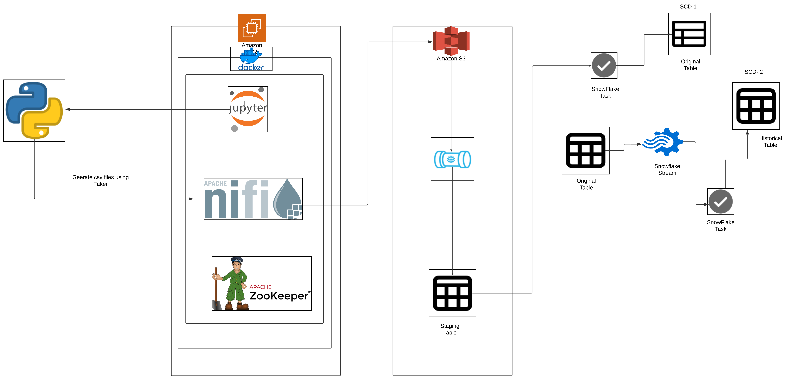

# Real-Time Data Streaming using Apache NiFi, AWS, Snowflake, Stream & Task

This project demonstrates the use of AWS, Apache NiFi, and Snowflake to implement real-time data ingestion and manage Slowly Changing Dimensions (SCD) Type 1 and Type 2 changes for customer data. This pipeline provides a scalable solution for both current and historical data tracking in a data warehouse.

## Table of Contents

- [Setup Instructions](#setup-instructions)
  - [Step 1: Create an EC2 Instance](#step-1-create-an-ec2-instance)
  - [Step 2: Configure Security Group](#step-2-configure-security-group)
  - [Step 3: Generate and Store Data](#step-3-generate-and-store-data)
  - [Step 4: Configure Apache NiFi](#step-4-configure-apache-nifi)
  - [AWS S3 Configuration](#aws-s3-configuration)
  - [Step 5: Snowflake Setup](#step-5-snowflake-setup)
  - [Step 6: Data Loading to Snowflake](#step-6-data-loading-to-snowflake)
  - [Step 7: Slowly Changing Dimension (SCD) Implementation](#step-7-slowly-changing-dimension-scd-implementation)
    - [SCD Type 1 (Current Data Only)](#scd-type-1-current-data-only)
    - [SCD Type 2 (Historical Data Tracking)](#scd-type-2-historical-data-tracking)
- [Conclusion](#conclusion)
- [References](#references)

## Setup Instructions

### Step 1: Create an EC2 Instance

1. **Install Docker Composer**
2. **Create the User for Docker in EC2**
3. **Install Pip Package**
4. **Copy the Docker Compose File to EC2 from your local machine**
5. **Start the Docker Container**
6. **Run `docker-compose up` in the EC2**
7. Services will run on certain ports:
   - Jupyter Lab: exposed on 4888 (internal port mapping is done between Docker and EC2 machine)
   - Zookeeper: 2181
   - NiFi: 2080

### Step 2: Configure Security Group

In Security Group, add inbound rules to allow traffic to the required ports.

### Step 3: Generate and Store Data

- Access Jupyter Notebook (port 4888) to generate fake data using the Faker library.
- Create a `Customer.csv` file containing the generated data.
- Save the file to `/opt/workspace/nifi/fake-dataset` in the Docker NiFi container.

### Step 4: Configure Apache NiFi

- Access NiFi (port 2080).
- Create three tasks in NiFi:
  - **List File**: Monitors the directory and detects new files.
  - **Fetch File**: Retrieves files detected by the List File task.
  - **Put S3 Object**: Uploads files to an AWS S3 bucket.

### AWS S3 Configuration

- In AWS IAM, create a user with S3 full access.
- Copy Access Key and Secret Key to configure NiFi.
- Set the Bucket Name and Object Key for file storage.

### Step 5: Snowflake Setup

- Create a new database and three tables in Snowflake:
  - **Customer Table**: Stores current customer data (SCD Type 1).
  - **Customer History**: Maintains all historical updates (SCD Type 2).
  - **Customer Raw Data**: Staging table for initial data loading.
- Create a Stream to track changes in the Customer table.

### Step 6: Data Loading to Snowflake

- Create an external stage in Snowflake linked to the S3 bucket.
- Define a File Format for incoming data.
- Configure a Pipe to load data from S3 to the `CUSTOMER_RAW` table in Snowflake.
- Link Snowpipe notifications to S3 using SQS Channel.

### Step 7: Slowly Changing Dimension (SCD) Implementation

#### SCD Type 1 (Current Data Only)

- Use a Merge Statement to update records in the Customer table:
  - Match records in `CUSTOMER_RAW` with `CUSTOMER`.
  - If a matching `customer_id` exists, update records.
  - If no match, insert new records.

##### Automate the Merge with a Stored Procedure:

- Create a stored procedure to handle the merge.
- Schedule the procedure to run every minute using a task.

#### SCD Type 2 (Historical Data Tracking)

- Set up a Stream on Customer Table to monitor changes.

##### Track Changes:

- For INSERT actions, add a new record to the `CUSTOMER_HISTORY` table.
- For UPDATE actions, close the previous version of the record and insert a new row.
- For DELETE actions, mark the end timestamp on the existing record.

##### Automate Historical Tracking:

- Set up tasks to automate these actions on a regular schedule.

## Conclusion

This project demonstrates the use of AWS, Apache NiFi, and Snowflake to implement real-time data ingestion and manage SCD Type 1 and SCD Type 2 changes for customer data. This pipeline provides a scalable solution for both current and historical data tracking in a data warehouse.

## References

- [Data Warehouse Snowflake for Data Engineering](https://github.com/darshilparmar/data-warehouse-snowflake-for-data-engineering/tree/2157ec45e7c6f01fa52c92d984a69c625e3608fa/Real-Time%20Data%20Streaming%20using%20Apache%20Nifi%2C%20AWS%2C%20Snowpipe%2C%20Stream%20%26%20Task)
- [Table Creation SQL](https://github.com/darshilparmar/data-warehouse-snowflake-for-data-engineering/blob/main/Real-Time%20Data%20Streaming%20using%20Apache%20Nifi%2C%20AWS%2C%20Snowpipe%2C%20Stream%20%26%20Task/SQL/1.%20Table%20Creation.sql)
- [Data Loading SQL](https://github.com/darshilparmar/data-warehouse-snowflake-for-data-engineering/blob/main/Real-Time%20Data%20Streaming%20using%20Apache%20Nifi%2C%20AWS%2C%20Snowpipe%2C%20Stream%20%26%20Task/SQL/2.%20Data%20Loading.sql)
